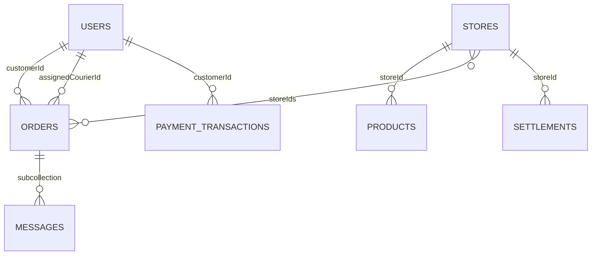

# الحسابات وقواعد البيانات

## مصدر البيانات

يوجد مساران مختلفان: Firebase للإنتاج، وSQLite على الهاتف للتجربة المحلية. SQLite يرث بعض عمليات الإدارة والمتاجر والمالية من `DemoRepository`؛ إنشاء الجداول لا يعني أن جميع هذه الميزات متصلة بها. لا تستخدم مسار الدخول المحلي ذي الرمز التجريبي كوسيلة توثيق إنتاجية.

## دليل الحسابات

| الحساب | الدور المحفوظ | الهوية والعلاقات | الدخول |
|---|---|---|---|
| العميل | customer | users/{uid}، orders.customerId | تطبيق أزهرنا |
| المتجر | store | users/{uid}.storeId → stores/{id}، products.storeId | تطبيق أزهرنا؛ اعتماد المتجر مستقل عن وجود الحساب |
| الإدارة | superAdmin؛ admin اسم قديم مدعوم | users/{uid} مع الدور في Auth claims وMFA | دخول الإدارة المعتمد |
| المندوب | courier | users/{uid} وorders.assignedCourierId | تطبيق المندوب؛ الدور في المستند وAuth claims والحساب النشط مطلوب |

تعريف أنواع الحسابات وتسمياتها في `lib/models/user_role.dart`. لا تُحوّل الأدوار غير المعروفة تلقائياً إلى عميل. عرض دور المندوب في لوحة الإدارة لا يمنحه صلاحيات؛ منح صلاحياته من الخادم حسب آلية `functions/scripts/grant-courier.js` الموجودة. تغيير دور المندوب من شاشة الحسابات محظور، ويمكن تغيير حالة نشاطه مع بقاء دوره.

## علاقات Firebase الحالية

| المجموعة | مسؤوليتها |
|---|---|
| users | هوية الحساب والدور والحالة وربط المتجر |
| stores / products | المتاجر المعتمدة والكتالوج |
| orders / orders/{id}/messages | الطلبات والمحادثات التابعة لها |
| settlements | مستحقات المتاجر |
| paymentTransactions | سجل عمليات الدفع |
| refundRequests | طلبات الاسترداد |
| auditLogs | سجل العمليات الإدارية |
| adminData/{scope}/records | إعدادات وسجلات إدارية، ومنها store_applications |

أسماء المجموعات ثابتة في `lib/data/firebase/firestore_schema.dart` وتُستخدم بالمستودع وشاشة المحادثات الحية. أسماء Firebase في وظائف الخادم وتطبيق المندوب تبقى متوافقة معها. قواعد الوصول الفعلية موجودة في `firestore.rules` ووظائف الخادم؛ إخفاء زر في الواجهة لا يُعد حماية للبيانات.

## SQLite والترقية

المخطط وترقياته في `lib/data/local/database_schema.dart`، والنسخة الحالية 6. الترقية من 5 إضافية فقط:

- عمودا `users.store_id` و`users.active`.
- 12 فهرساً للحسابات والمدن والمنتجات والطلبات والمحادثات والمستلمين والمحفظة ومهام التوصيل والسجلات.
- لا حذف جداول ولا تغيير معرفات أو إعادة إسناد طلبات قديمة.

حسابات المستخدمين المحلية تُقرأ وتُحدّث من جدول users، وتُسجل تعديلات الحسابات في local_records ضمن account_audit. الدخول يحافظ على الاسم والدور والنقاط وتاريخ الإنشاء للحساب الموجود. الحساب الجديد يحصل على معرف مستقل مشتق من رقم الهاتف الموحد، بدلاً من اشتراك العملاء في customer-1. الصيغ المتكافئة للرقم العربي/الدولي تُطابق الحساب نفسه؛ التعارض بين سجلين يوقف الدخول للمراجعة، ولا يدمجهما تلقائياً.

عند تسجيل الخروج تُمسح هوية المستودع المحلي. إنشاء الطلب يتطلب هوية مسجلة ولا يُسند افتراضياً إلى customer-1. تبقى السجلات القديمة بمعرفاتها؛ لا يمكن استنتاج المالك الصحيح لبيانات دُمجت سابقاً دون مراجعة مصدر موثوق.

## حدود ما أُنجز

هذه التعديلات تنظم الكود والمخطط المحلي ومسارات الحسابات. لا تتضمن نقل سجلات Firebase الحية أو دمجها أو حذفها أو نشر قواعد صلاحيات جديدة. ربط جميع جداول المتجر والمالية المحلية بدلاً من تنفيذاتها التجريبية عمل مستقل. في الإنتاج يُستخدم Firebase مع اعتماد الحسابات من الخادم.

## التحقق

- `flutter test --no-pub`: توافق التطبيق والحسابات والأدوار ومسارات الترقية.
- `node --test test/database_migration.test.cjs`: تنفيذ SQL على SQLite فعلي ومقارنة البيانات قبل الترقية وبعدها؛ يتطلب Node الداعم لـnode:sqlite.
- تؤخذ نسخة احتياطية من قاعدة الهاتف وملفات WAL قبل تثبيت إصدار يرفع نسخة المخطط. مراجعة قاعدة Firebase الحية تتم بتقرير قراءة فقط قبل أي ترحيل.

## التحقق على الهاتف — 2026-09-06
أُخذت نسخة احتياطية قبل التثبيت، وجُرّبت الترقية على نسخة منها، ثم رُقّي الهاتف من SQLite 5 إلى 6. المقارنة شملت قيم البيانات القديمة في 33 جدولاً؛ بقيت 3 حسابات و3 طلبات موجودة، ونتيجة integrity_check سليمة. النسخ الخاصة مستبعدة من Git في artifacts/database-backup/device*/. بيانات Firebase الحية لم تتغير.
