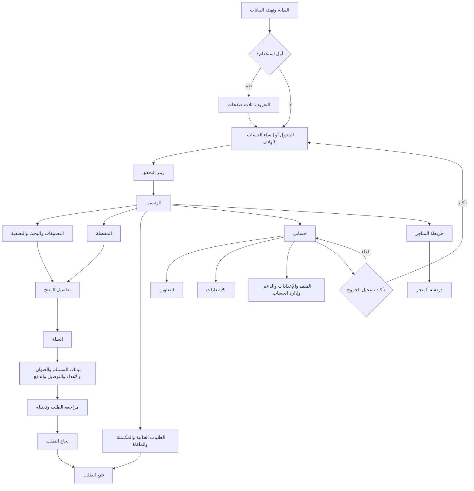

# أزهارنا — نظام الواجهات Material 3

## الهوية المشتركة

- المصدر: `lib/core/app_theme.dart` و`lib/core/design_tokens.dart`.
- لون الهوية الأساسي: `#087E9A`، والثانوي `#07877E`، مع ColorScheme مستقل للوضع الداكن.
- الخط: IBM Plex Sans Arabic، واتجاه الواجهة RTL.
- المسافات المرجعية: 8، 16، 24 نقطة منطقية.
- الأزرار الرئيسية: ارتفاع أدنى 52؛ أهداف اللمس: 48.
- الحقول: نصف قطر 12؛ البطاقات: 20؛ نوافذ الحوار: 28.
- شبكة المنتجات تتغير حسب عرض الشاشة وحجم النص.
- يحفظ التطبيق اختيار المظهر وإكمال التعريف محلياً.

## خريطة التنقل المنفذة

شريط التنقل: الرئيسية، التصنيفات، المفضلة، الطلبات، حسابي. الخريطة والمحادثات متاحتان من الرئيسية والحساب. يبقى تحميل التبويبات عند أول زيارة مع الاحتفاظ بحالتها.

## تغطية القائمة المطلوبة وحدود التنفيذ

شاشات البداية والتعريف والمفضلة والتصنيفات ومراجعة الطلب ونجاحه لها صفحات مخصصة. بيانات المستلم والإهداء والعنوان وموعد التوصيل والدفع مجمعة حالياً في صفحة إتمام الطلب، ثم تعرض في صفحة المراجعة قبل الإرسال. وظائف الملف والإعدادات والدعم تستخدم صفحات الحساب الموجودة؛ تطبيق الثيم عليها لا يعني تحويل جميع حقولها العامة إلى خدمات مكتملة.

تسجيل الدخول وإنشاء الحساب يستعملان مسار الهاتف ورمز التحقق الموجود؛ لا توجد مصادقة جديدة بكلمة المرور أو Google أو Apple. الدفع الفعّال هو النقد عند الاستلام. اختيار فترات توصيل فعلية أو إضافات المنتجات وأسعارها أو الدفع الإلكتروني والتوصيات الشخصية يحتاج نموذج بيانات وربط خدمات إضافية. لا تعرض الواجهة نجاح دفع إلكتروني وهمياً.

نسخة الهاتف المحلية تستعمل SQLite؛ مشاركة الطلبات والدردشة بين أجهزة مختلفة تحتاج المستودع المتصل بالخادم. تحديث التصميم لا يغير ذلك.

## التحقق

`flutter analyze lib test` و`flutter test`. اختبار `redesign_test.dart` يفحص الواجهات الرئيسية على عروض 320 و390 و768 و1024 بالثيمين، ويصدر صور الرئيسية إلى `artifacts/reference`. اختبار الشراء يتحقق من أن المراجعة لا ترسل الطلب قبل التأكيد، ومن منع الإرسال المكرر وحفظ السلة عند فشل الطلب.
