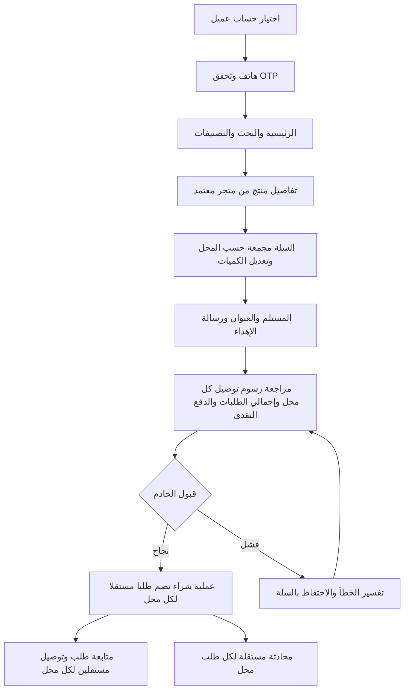

# رحلات المستخدم ومخططات الشاشات الأولية

تاريخ: 2026-09-08. مسودة للنسخة الأولى مرتبطة بـ[المتطلبات](V1_REQUIREMENTS_AR.md). المخططات أدناه توصيف أولي للترتيب والمحتوى وليست ملف Figma أو مراجعة بصرية للتطبيق على هاتف.

## رحلة العميل

مسارات الاستثناء: رمز خاطئ أو منتهي، حساب موقوف، منتج نفد أو تغير سعره، انقطاع بعد إرسال الطلب، رفض إذن الموقع، عنوان خارج الخدمة. إعادة المحاولة يجب أن تستخدم هوية العملية نفسها إذا لم يتغير محتواها. عرض مواعيد محددة أو رسوم غير مؤكدة يحتاج تنفيذ سياسة فعلية أولًا.

## رحلة المتجر

تسجيل متجر ← تقديم بياناته وموقعه ← انتظار مراجعة الإدارة ← اعتماد وربط الحساب ← إضافة منتجات وصور ← اعتماد المنتجات ← استقبال طلب ← التجهيز ← التنسيق مع المندوب ← متابعة التسليم والمستحقات.

عند الرفض يظهر السبب وطريق التصحيح. المتجر غير المرتبط لا يصل إلى بيانات متجر آخر. حسب قرار تعدد المحلات، يستقبل كل متجر طلبه المستقل من السلة؛ تجهيزه أو تسليمه لا يغير حالة طلب متجر آخر. يتطلب ذلك تعديل التنفيذ الحالي الذي يستخدم حالة مشتركة.

بعد الاعتماد يفتح المحل إعدادات التوصيل، ويحدد رسومه بالدينار العراقي ويحفظها. يظهر نجاح الحفظ بعد قبول الخادم فقط، وتؤثر الرسوم الجديدة على الطلبات الجديدة. تغيير الرسوم أثناء مراجعة العميل للسلة يستلزم عرض المجموع الجديد وإعادة التأكيد. تُوضح للمحل أن الطلبات القائمة تحتفظ برسومها الأصلية.

## رحلة المندوب

اعتماد حساب المندوب من جهة مخولة ← الدخول إلى التطبيق المستقل ← عرض الطلبات المسندة ← فتح عنوان المستلم ← استلام الطلب الجاهز وتحديثه إلى قيد التوصيل ← التسليم ← توثيق التحصيل وفق المسار المطلوب في FR-07.

لكل محل مهمة توصيل مستقلة؛ تعرض المهمة مبلغ طلب هذا المحل مع رسم توصيله فقط. تسليم المهمة لا يُكمل مهام المحلات الأخرى، حتى إذا أُسندت إلى المندوب نفسه. فشل الشبكة لا يُعرض كتسليم ناجح. تُختبر إزالة صلاحية الوصول عند تغيير الإسناد. تعذر التسليم والإلغاء والتحصيل الجزئي تحتاج سياسات قبل إضافة أزرارها.

## رحلة الإدارة

دخول الإدارة بالبريد والتحقق الإضافي ← مراجعة طلبات المتاجر ← اعتماد المنتجات ← متابعة الطلبات ← إسناد مندوب ← معالجة الاستثناءات والشكاوى ← مراجعة التحصيل والتسويات ← متابعة الأعطال وطلبات حذف الحسابات العالقة.

## رحلة حذف حساب العميل

الحساب ← طلب الحذف وشرح الأثر ← إعادة توثيق عند الحاجة ← إرسال الطلب للخادم ← عرض قبول الطلب ← معالجة مجدولة أو تأجيل لالتزامات عالقة ← اكتمال التنفيذ أو تنبيه للمشغل عند الفشل. قبول الطلب ليس اكتمال الحذف.

## Wireframes نصية للشاشات الأساسية

تُرتب العناصر رأسيًا من أعلى الشاشة إلى أسفلها، مع محاذاة عربية RTL.

| الشاشة | ترتيب العناصر | الفعل الرئيسي | حالات يجب تصميمها |
|---|---|---|---|
| الدخول | شعار، نوع الحساب، الهاتف، شرح التحقق | إرسال رمز ثم التحقق | رقم غير صالح، انتظار إعادة الإرسال، رمز خاطئ |
| الرئيسية | منطقة التوصيل، البحث، التصنيفات، المتاجر، المنتجات، شريط التنقل | فتح منتج أو متجر | تحميل، لا نتائج، خطأ اتصال |
| المنتج | صورة، اسم ومتجر، سعر وتوفر، وصف، كمية، إجمالي | إضافة للسلة | نفاد المخزون، منتج غير متاح |
| السلة | قسم لكل محل يتضمن منتجاته وكمياته ومجموعه ورسم توصيله المستقل، إجمالي السلة | متابعة شراء طلبات المحلات | فارغة، تغير سعر، منتج أُوقف |
| تأكيد الطلب | إهداء اختياري، مستلم وهاتف، منطقة وعنوان وموقع، ملخص مبلغ كل طلب ورسم توصيله وإجمالي الجميع، توضيح تعدد التوصيلات | تأكيد مرة واحدة | تحقق الحقول، إرسال، فشل قابل لإعادة المحاولة |
| متابعة الطلبات | رقم عملية الشراء، بطاقة لكل طلب محل ورقمه وحالته ومجموعه، تفاصيل ومحادثة منفصلة | فتح طلب المحل ومتابعته | طلب سُلّم وآخر قيد التجهيز، فقد اتصال، استثناء يحتاج دعمًا |
| لوحة المتجر | حالة الاعتماد، ملخص الطلبات، منتجات تحتاج مراجعة | تجهيز الطلب/إضافة منتج | غير معتمد، لا طلبات، رفض منتج |
| إعدادات توصيل المحل | الرسوم الحالية، حقل مبلغ بالدينار العراقي، توضيح أن الصفر مجاني وأن التعديل للطلبات الجديدة | حفظ رسوم التوصيل | غير مضبوطة، قيمة غير صالحة، جارٍ الحفظ، رفض صلاحية، فشل حفظ |
| مهمة المندوب | رقم الطلب، جهة الاستلام، عنوان المستلم، الحالة، المبلغ النقدي | بدء التوصيل ثم التسليم | لا إسناد، فقد صلاحية، تعذر تسليم |
| الإدارة | تنقل للأقسام، قائمة قابلة للبحث، تفاصيل السجل، سجل إجراءات | اعتماد/إسناد | صلاحية مرفوضة، قائمة فارغة، فشل حفظ |

## مواصفات التسليم للتصميم النهائي

استخدام الهوية والخط الحاليين كنقطة بداية؛ مراجعة التباين وتكبير النص ومساحات اللمس عمليًا. لكل شاشة: حالة عادية وتحميل وفراغ وخطأ، مع مكونات موحدة للبطاقات والحقول والأزرار ورسائل التحقق. اعتماد محتوى تأكيد الطلب وحالاته يسبق التجميل. نقل هذه المسودة إلى Figma مرحلة لاحقة ولم يُنفذ ضمن هذه المراجعة.
